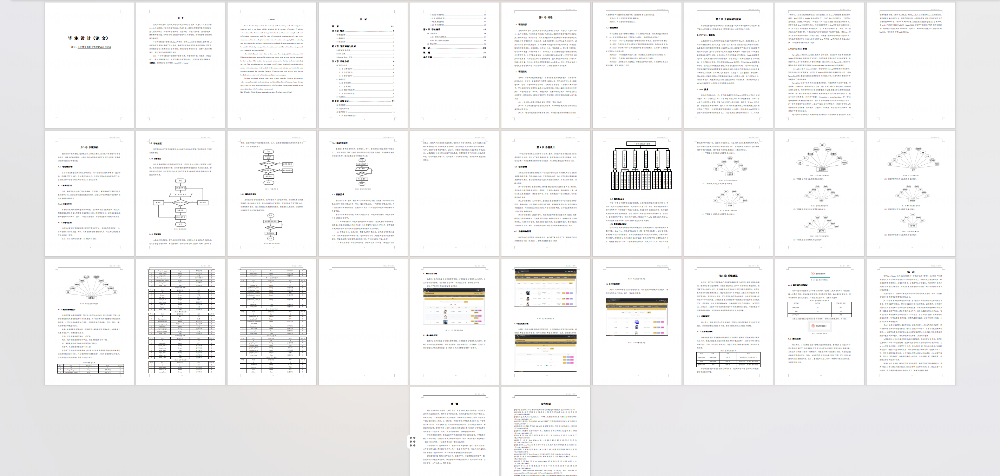
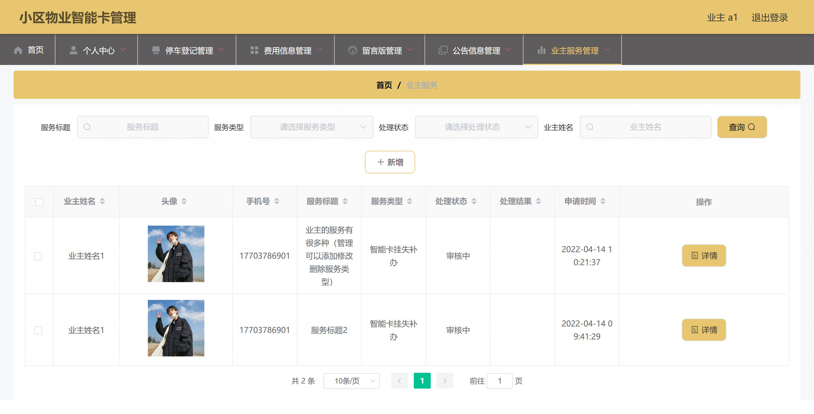
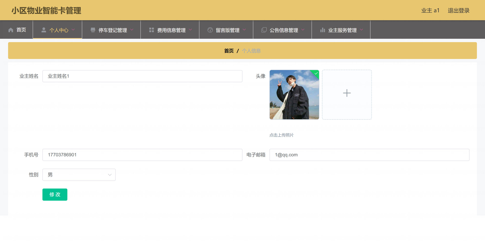
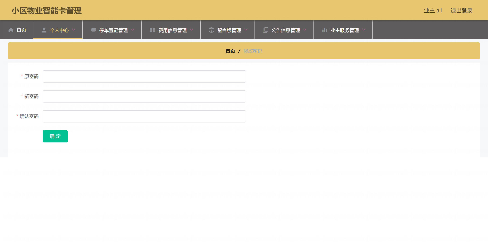
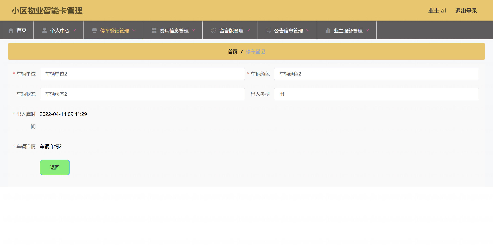
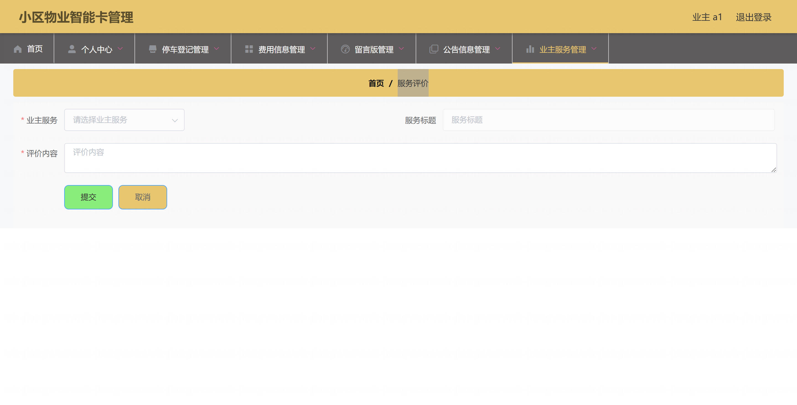
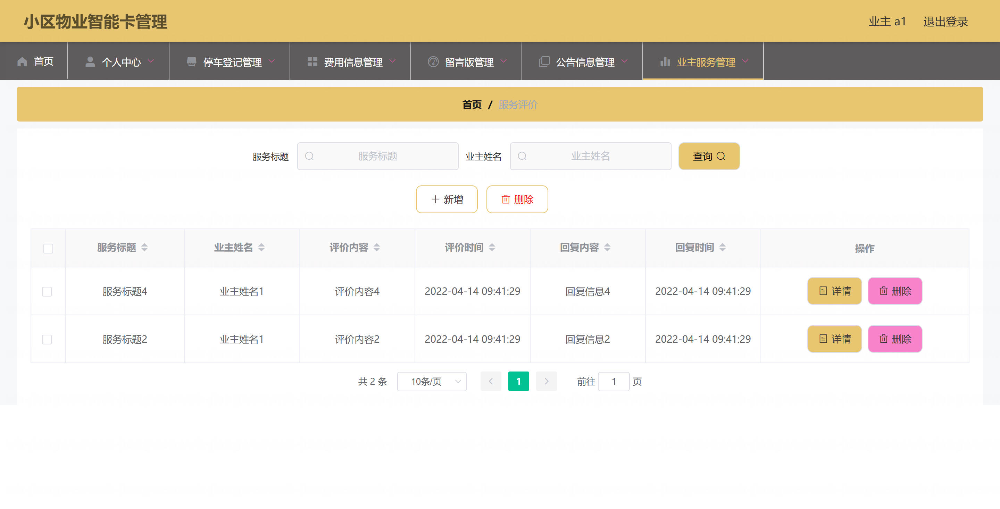

基于Springboot的小区物业智能卡管理系统（程序+论文）
=

### 完整代码获取地址：从戎源码网 ([https://armycodes.com/](https://armycodes.com/))
### 作者微信：19941326836  QQ：952045282 
### 承接计算机毕业设计、Java毕业设计、Python毕业设计、深度学习、机器学习
### 选题+开题报告+任务书+程序定制+安装调试+论文+答辩ppt 一条龙服务
### 所有选题地址https://github.com/nature924/allProject

一、项目介绍
---

基于 Spring Boot 的小区物业智能卡管理系统，主要角色为管理员（后台）与业主（前端）。主要功能如下：

管理员（后台）：
基本操作：登录、登出、修改密码、获取/修改个人信息、获取 session 用户信息
用户管理：分页/列表查询、查看详情、新增、修改、删除、重置密码、注册管理
业主管理：业主分页/详情、新增（默认密码）、修改、逻辑删除、批量导入（xls）、业主密码重置/忘记密码处理
停车管理：车辆入出（停车登记）分页/详情、新增、修改、删除、批量导入、级联业主信息显示
费用管理：费用记录分页/详情、新增、修改、删除、批量导入
业主服务：服务请求分页/详情、新增、修改、管理员审核（shenhe）、删除、批量导入
公告管理：公告分页/详情、新增、修改、删除、批量导入
留言板：留言分页/详情、新增、修改、删除、批量导入、回复记录管理

业主（前端）：
账号：注册、登录、登出、获取/修改个人信息、密码重置/忘记密码
查看与操作：查看公告、留言（新增/查看）、提交业主服务请求、查看个人停车记录、缴费/查看费用记录、文件上传（如图片/附件）
列表/详情：查看自己的列表数据（系统根据 role/session 过滤，仅能查看/操作自身相关数据）

二、项目技术
---
- 编程语言：Java
- 数据库：MySQL
- 项目架构：B/S架构
- 前端技术：JSP
- 后端技术：Spring、SpringMVC、MyBatis

三、运行环境
---
- 操作系统：Windows、macOS都可以
- JDK版本：JDK1.8以上都可以
- 开发工具：IDEA、Ecplise、Myecplise都可以
- 数据库: MySQL5.7以上都可以
- Tomcat：任意版本都可以
- Maven：任意版本都可以

四、运行截图
---
### 论文截图：

### 程序截图：

